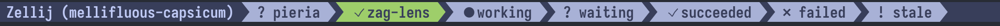

# Zag Lens

[](https://github.com/VAlux/zag-lens/actions/workflows/release.yml)



Zag Lens is a background Zellij plugin that reports Codex, Claude Code, and
OpenCode agent state in tab titles and notifies the user when an agent needs
interaction. It uses lifecycle hooks and a versioned JSON protocol; it does not
scrape terminal contents or agent transcripts.

This repository contains the Rust host executable, Zellij WASM plugin, adapters,
installer, notification backends, and deterministic test fixtures.

## Quick Start

Prebuilt releases support macOS and Linux on Intel and ARM. Installing one does
not require Rust or a source checkout. You need Zellij, `curl`, `tar`, and at
least one supported agent harness.

Review the
[installer script](https://github.com/VAlux/zag-lens/blob/main/scripts/install.sh),
then run:

```sh
curl -fsSL https://raw.githubusercontent.com/VAlux/zag-lens/main/scripts/install.sh | sh
```

The script detects the host platform, downloads the native binary and WASM
plugin from the [latest release](https://github.com/VAlux/zag-lens/releases/latest),
verifies both against `SHA256SUMS`, and runs the user-level installer.

By default, setup configures Zellij, Codex, Claude Code, and OpenCode while
preserving unrelated configuration. Then restart Zellij and OpenCode, approve
the requested application-state permissions, and inspect and trust the Zag Lens
commands in Codex with `/hooks`. Claude Code and OpenCode do not require a
separate hook-trust step.

The installer places the host executable, Zellij WASM plugin, and OpenCode
integration in user-level XDG or `~/.local` directories. Confirm the result
with:

```sh
~/.local/bin/zag-lens doctor
```

## Supported Harnesses

| Harness | Baseline | Integration |
| --- | --- | --- |
| Codex CLI | 0.144.3 | Observational command lifecycle hooks. |
| Claude Code | 2.1.207 | Observational command and notification hooks. |
| OpenCode | 1.17.15 | Auto-loaded global plugin for the local TUI. |

OpenCode support currently targets a local `opencode` TUI started inside a
Zellij pane. Child and background-agent sessions participate in the tab's
aggregate status. `opencode serve`, `opencode attach`, web and desktop clients,
and remote cross-pane routing are not yet supported.

Setup installs a dependency-free plugin at
`$XDG_CONFIG_HOME/opencode/plugins/zag-lens.js`, or
`~/.config/opencode/plugins/zag-lens.js` when `XDG_CONFIG_HOME` is unset.
OpenCode loads this directory automatically, so no `opencode.json` entry or npm
dependency is required. Restart a running OpenCode TUI after setup or upgrade.

## Updating

Rerun the installer to download and install the latest release:

```sh
curl -fsSL https://raw.githubusercontent.com/VAlux/zag-lens/main/scripts/install.sh | sh
```

The installer atomically replaces the native executable and WASM plugin while
preserving existing configuration and hooks. Setup is idempotent, so rerunning
it when Zag Lens is already current leaves the configuration unchanged. Restart
Zellij and any running OpenCode TUI afterward to load the updated plugins.

## Tab Statuses

Zag Lens respects the user's existing Zellij tab bar. It does not install,
replace, or render a tab-bar plugin; it only decorates the affected tab's title.
The original title remains the base title, user renames are preserved, and the
base title is restored when no visible agent status remains.

By default, Zag Lens prefixes the tab's existing title with the highest-priority
visible agent status:

| State               | Icon | Example          | Meaning                                        |
| ------------------- | ---- | ---------------- | ---------------------------------------------- |
| `working`           | `●`  | `● api-refactor` | The agent is processing a turn or using tools. |
| `waiting_for_user`  | `?`  | `? migrations`   | The agent needs user interaction.              |
| `succeeded`         | `✓`  | `✓ tests`        | The most recent turn completed successfully.   |
| `failed`            | `×`  | `× deploy`       | The most recent turn or session failed.        |
| `stale`             | `!`  | `! review`       | Activity stopped without a terminal event.     |
| `ready` / `stopped` | none | `project`        | No active status is displayed.                 |

Icons and the title format are configurable; see
[configuration](docs/configuration.md).

## Plugin Configuration

The installer creates a `zag-lens` alias in the resolved Zellij `config.kdl`.
Customize the plugin by adding or changing child settings on that alias while
keeping the installer-generated absolute `location` and `host_binary` paths:

```kdl
plugins {
    zag-lens location="file:/absolute/path/to/zag-lens.wasm" {
        host_binary "/absolute/path/to/zag-lens"
        title_format "{icon} {title}"
        icon_set "unicode"
        show_counts "false"
        success_ttl_seconds "30"
        stale_after_seconds "1800"
        notification_policy "waiting-and-complete"
        notification_focus "inactive-tab"
        notification_backend "auto"
    }
}
```

Common settings are:

| Setting | Default | Purpose |
| --- | --- | --- |
| `enabled` | `true` | Enables lifecycle-event processing and title updates. |
| `title_format` | `{icon} {title}` | Controls the decorated tab-title format. |
| `icon_set` | `unicode` | Selects `unicode` or `ascii` built-in icons. |
| `show_counts` | `false` | Shows a count when several agents share the winning state. |
| `success_ttl_seconds` | `30` | Controls how long successful completion remains visible. |
| `stale_after_seconds` | `1800` | Marks non-terminal activity stale after this interval. |
| `notification_policy` | `waiting-only` | Controls waiting and completion notifications. |
| `notification_focus` | `inactive-tab` | Selects `inactive-tab`, `always`, or `never`. |
| `notification_backend` | `auto` | Selects `auto`, `applescript`, `command`, `bell`, or `off`. |

On macOS, `notification_backend "auto"` uses the built-in AppleScript backend
and needs no custom command configuration. Invalid settings fall back safely and
do not disable title updates. Restart Zellij after changing plugin settings.

The OpenCode integration has no separate Zag Lens settings. Its global plugin
forwards sanitized lifecycle events into the same Zellij plugin configuration.
See [configuration](docs/configuration.md) for every setting, custom icons,
command-backend arguments, bounds, privacy behavior, and permissions.

## Source-build Prerequisites

- Rust 1.94.1 managed by `rustup`
- the `rustfmt` and `clippy` components
- the `wasm32-wasip1` target
- Zellij 0.44.1 or newer for integration testing
- Codex CLI 0.144.3, Claude Code 2.1.207, and OpenCode 1.17.15 for live adapter
  smoke tests

The checked-in `rust-toolchain.toml` selects the required Rust components and
target automatically.

## Build and Install from Source

Build the native executable and WASM plugin:

```sh
cargo build --release -p zag-lens
cargo build --release -p zag-lens-plugin --target wasm32-wasip1
```

Preview the user-level configuration changes, then apply them:

```sh
target/release/zag-lens setup \
  --plugin-wasm target/wasm32-wasip1/release/zag_lens_plugin.wasm \
  --dry-run
target/release/zag-lens setup \
  --plugin-wasm target/wasm32-wasip1/release/zag_lens_plugin.wasm
```

To install or preview only the OpenCode integration, the WASM path is not
required:

```sh
target/release/zag-lens setup --opencode --dry-run
target/release/zag-lens setup --opencode
```

Setup preserves unrelated Zellij and harness configuration and records its own
entries for safe uninstall. Restart Zellij and OpenCode after setup. In Codex,
inspect and trust the installed commands with `/hooks` before expecting events.

See [installation](docs/installation.md) and
[configuration](docs/configuration.md) for paths, component selection,
permissions, and uninstall instructions.

## Development

```sh
cargo fmt --all --check
sh -n scripts/install.sh scripts/test-install.sh
shellcheck scripts/install.sh scripts/test-install.sh
sh scripts/test-install.sh
cargo clippy --workspace --all-targets -- -D warnings
cargo test --workspace --exclude zag-lens-plugin
cargo test -p zag-lens-opencode-adapter
cargo test -p zag-lens-plugin --bin zag_lens_plugin
cargo check -p zag-lens-plugin --target wasm32-wasip1
cargo build -p zag-lens-plugin --release --target wasm32-wasip1
```

Hook and adapter code must remain fail-open and stdout-silent. Never derive
agent state by scraping terminal output, transcripts, prompts, or assistant
message text.

The [development guide](docs/development.md) covers package-specific tests and
manual live smoke tests. See [compatibility](docs/compatibility.md) for the
tested versions, event coverage, and current limitations. `SPECIFICATION.md`
defines the behavior contract.

## Privacy and Permissions

The plugin requests `ReadApplicationState` and `ChangeApplicationState` for tab
mapping and titles. It requests `RunCommands` only when notifications are
enabled. Denying that optional permission leaves title status operational.

Zag Lens transports normalized lifecycle metadata, never full prompts, tool
arguments, tool results, command output, or transcripts. The OpenCode plugin
projects native events onto allowlisted identifiers and coarse status fields
before invoking the bridge; raw OpenCode event payloads are not transported.
Notification text is sanitized and bounded before delivery.

## Release Artifacts

Tags named `v<workspace-version>`, for example `v0.1.0`, publish four native
archives and one portable Zellij plugin:

- `x86_64-unknown-linux-gnu` and `aarch64-unknown-linux-gnu`
- `x86_64-apple-darwin` and `aarch64-apple-darwin`
- `zag-lens-plugin-<version>.wasm`

Each release includes `SHA256SUMS`. The installer script filters that manifest
to the native archive and WASM asset for the current platform and verifies both
before installation.

The release workflow rejects a tag whose version does not exactly match the
workspace version in `Cargo.toml`.

## License

Licensed under either the Apache License, Version 2.0 or the MIT license, at your
option.
