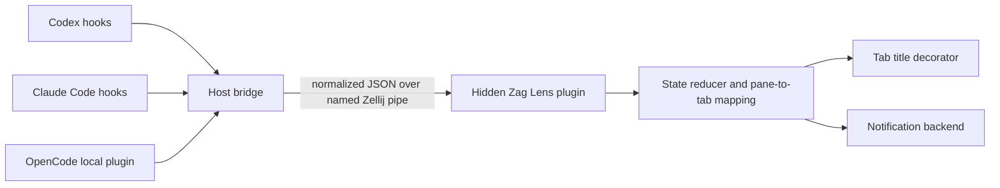

# Zag Lens: agent activity for Zellij

Status: Draft 0.1  
Date: 2026-07-13

## 1. Summary

Zag Lens is a background Zellij plugin that shows the state of terminal-based
coding agents in Zellij tab titles and notifies the user when an agent needs
interaction.

The first supported agent harnesses are Codex CLI, Claude Code, and the local
OpenCode TUI. The design uses harness lifecycle events and a versioned,
harness-neutral event protocol so that other harnesses can be added without
changing the core plugin.

The MVP must:

1. Receive lifecycle events emitted by Codex, Claude Code, and OpenCode.
2. Normalize those events into a small common state model.
3. Associate each agent session with the Zellij pane and tab in which it runs.
4. Add a simple status icon to the affected tab title.
5. Notify the user when an agent requires attention.
6. Restore the user's original tab title when the status is cleared or the
   plugin shuts down normally.

## 2. Terminology

- **Harness**: A terminal agent application, initially `codex`, `claude`, or
  `opencode`.
- **Harness event**: A native lifecycle hook invocation from a harness.
- **Adapter**: Code that translates one harness's event into the Zag Lens event
  protocol.
- **Bridge**: The host executable invoked by harness hooks. It reads hook JSON,
  invokes an adapter, captures Zellij environment context, and sends the
  normalized event to the plugin.
- **Agent instance**: One independently tracked main session or subagent.
- **Canonical state**: The harness-neutral state derived from one or more
  events.
- **Attention event**: An event indicating that progress is blocked on a user
  response, permission, choice, authentication step, or elicitation.
- **Base title**: The tab title without Zag Lens decoration.
- **Rendered title**: The base title plus the current Zag Lens status prefix.

The keywords **MUST**, **SHOULD**, and **MAY** are normative.

## 3. Goals

- Make agent activity visible without opening every tab.
- Surface user-interaction requests promptly and without duplicate alerts.
- Support multiple agent panes and multiple harnesses in one Zellij session.
- Use documented lifecycle hooks rather than parsing terminal screen contents.
- Degrade safely when a harness, Zellij, or the desktop notification service is
  unavailable.
- Keep the core state machine independent from harness-specific payloads.

## 4. Non-goals

The MVP will not:

- Control an agent or answer permission prompts on the user's behalf.
- Read, parse, or persist complete agent transcripts.
- Infer state by scraping terminal output, pane titles, or process output.
- Provide a task dashboard, transcript viewer, cost display, or token meter.
- Synchronize status between separate Zellij sessions or machines.
- Guarantee desktop notifications when the operating system has disabled them.
- Treat hook delivery as a security or policy enforcement boundary.

## 5. User experience

### 5.1 Default icons

| State | Default icon | Meaning |
| --- | --- | --- |
| `working` | `●` | The agent is processing a turn or using tools. |
| `waiting_for_user` | `?` | The agent is blocked on user interaction. |
| `succeeded` | `✓` | The most recent turn completed successfully. |
| `failed` | `×` | The most recent turn or session failed. |
| `stale` | `!` | Activity stopped without a conclusive lifecycle event. |
| `ready` / `stopped` | none | No active status needs to be shown. |

Icons MUST be configurable. An ASCII preset MUST be available for terminals or
fonts that do not render the defaults correctly.

A scalar icon override MUST remain static. A non-empty JSON string array MAY
define animation frames for any visible state; one frame is static and two or
more frames animate. Invalid arrays or frames MUST fall back to that state's
built-in icon and produce only a sanitized diagnostic. Implementations SHOULD
recommend equal-width frames to avoid tab-bar jitter.

### 5.2 Title format

The default format is:

```text
<icon> <base-title>
```

Examples:

```text
● api-refactor
? migrations
✓ tests
```

The plugin MUST preserve the base title. It MUST NOT repeatedly prepend icons.
If the user renames a managed tab, the new name becomes its base title and the
current decoration is reapplied.

The completed icon remains for a configurable terminal-state period, 30 seconds
by default, and is then removed. Failure remains visible until new activity,
explicit clearing, pane closure, or session end.

### 5.3 Multiple agents in one tab

Each agent instance is tracked independently. A tab derives one aggregate state
from all agent instances in its panes.

The default priority is:

```text
waiting_for_user > failed > working > succeeded > stale > ready/stopped
```

Only the highest-priority icon is rendered in the MVP. If more than one agent
contributes to that state, the optional count format is `<icon><count>`, for
example `?2 review`. Counts are disabled by default to keep titles compact.

### 5.4 Notifications

Entering `waiting_for_user` MUST produce an attention notification unless
notifications are disabled. Repeated native events for the same outstanding
interaction MUST NOT produce repeated notifications.

The default notification contains:

- the harness display name;
- the Zellij tab name;
- a coarse interaction kind such as `permission`, `question`, `authentication`,
  or `elicitation`;
- a short sanitized summary when the harness explicitly supplies one.

Prompt text, tool arguments, command output, and transcript content MUST NOT be
included by default. A user MAY opt in to message details.

Notification policy is configurable:

- `waiting-only` (default): notify only on a transition into
  `waiting_for_user`;
- `waiting-and-complete`: also notify on successful or failed turn completion;
- `off`: title changes only.

Focus policy is configurable:

- `inactive-tab` (default): suppress the desktop alert when the affected tab is
  already active;
- `always`: alert regardless of active tab;
- `never`: equivalent to title-only notification.

Zellij exposes active-tab state but not reliable operating-system window focus.
Therefore, `inactive-tab` refers only to Zellij tab focus.

## 6. System architecture



### 6.1 Harness hook packages

Each harness integration supplies hook configuration that invokes the same
bridge executable with a harness selector and native event name. Integrations
SHOULD be distributable as harness-native plugins where the harness supports
that packaging model, with documented user-level configuration as a fallback.

Installing an integration MUST NOT replace unrelated hooks. Hook handlers MUST
be observational: they return success without changing the harness's decision
or execution flow.

### 6.2 Host bridge

The bridge is a small native executable because harness hooks execute on the
host while the Zellij plugin runs as WebAssembly.

For every invocation it MUST:

1. Read exactly one native hook JSON object from standard input.
2. Select the requested adapter.
3. Normalize the event.
4. Capture `ZELLIJ_PANE_ID` and the current Zellij session environment.
5. Send the normalized JSON to the named pipe `zag-lens:event`.
6. Exit without writing to standard output.

Writing to hook stdout can alter harness behavior, so the bridge MUST keep
stdout empty. Expected failures are silent by default and MUST NOT block the
harness. Diagnostic logging to stderr or a file is opt-in.

If the process is not inside Zellij, Zellij is unavailable, the plugin is not
installed, or a payload is invalid, the bridge SHOULD record a diagnostic when
debugging is enabled and MUST exit successfully.

The recommended transport is equivalent to:

```text
zellij pipe --name zag-lens:event --plugin zag-lens -- <normalized-json>
```

The plugin SHOULD be preloaded as a background plugin. If a pipe launches it on
first use, it MUST hide itself immediately after requesting required
permissions.

### 6.3 Zellij plugin

The plugin is the authoritative runtime state owner within one Zellij session.
It MUST:

- implement the pipe lifecycle method and accept only `zag-lens:event` payloads;
- subscribe to `PaneUpdate`, `TabUpdate`, `PaneClosed`, `Timer`,
  `PermissionRequestResult`, and `BeforeClose` as needed;
- map the event's terminal pane ID to a stable tab ID using Zellij application
  state rather than trusting a tab ID supplied by the bridge;
- reduce normalized events into per-agent and aggregate per-tab state;
- rename affected tabs by stable ID;
- invoke the configured notification backend;
- clean state when a pane or tab closes;
- avoid rendering a visible pane during normal operation.

Events arriving before the initial pane manifest is available SHOULD be queued
briefly and replayed after the mapping is known. An event that cannot be mapped
after the configured mapping timeout is discarded with a diagnostic.

### 6.4 Zellij permissions

The title feature requires:

- `ReadApplicationState`, to receive pane and tab state;
- `ChangeApplicationState`, to rename tabs.

Host-command notification backends additionally require `RunCommands`. This
permission MUST be optional: denying it disables desktop notifications but MUST
NOT disable title status.

The plugin MUST NOT request full disk access, input interception, pane-content
access, clipboard access, or write-to-stdin permission for the MVP.

## 7. Normalized event protocol

Every bridge-to-plugin message is UTF-8 JSON with this logical shape:

```json
{
  "schema_version": 2,
  "event_id": "01J...",
  "occurred_at": "2026-07-13T12:00:00.000Z",
  "harness": "codex",
  "native_event": "PermissionRequest",
  "kind": "interaction_required",
  "state": "waiting_for_user",
  "session_id": "harness-session-id",
  "agent_instance_id": "harness-session-id",
  "turn_id": "optional-turn-id",
  "pane_id": "terminal_3",
  "zellij_session": "work",
  "cwd": "/workspace/project",
  "attention": {
    "kind": "permission",
    "summary": "Permission required"
  },
  "adapter": {
    "name": "codex",
    "version": 1
  }
}
```

### 7.1 Required fields

`schema_version`, `event_id`, `occurred_at`, `harness`, `native_event`, `kind`,
`state`, `session_id`, `agent_instance_id`, `pane_id`, and `adapter` are required.
`turn_id`, `zellij_session`, `cwd`, and `attention` are optional.

The accepted `kind` values in schema version 1 are:

- `session_started`;
- `turn_started`;
- `activity`;
- `interaction_required`;
- `turn_completed`;
- `turn_failed`;
- `session_ended`.

Schema version 2 retains all version 1 kinds and adds `turn_cancelled`. A
version 2 consumer MUST continue to accept version 1 payloads. Producers MUST
emit the latest schema version. Unknown future schema versions MUST be rejected
without changing state.

The accepted `state` values are `ready`, `working`, `waiting_for_user`,
`succeeded`, `failed`, `stale`, and `stopped`.

Unknown fields MUST be ignored. Payloads larger than 64 KiB MUST be rejected.
Adapters SHOULD discard native fields not needed by the normalized protocol
before transport.

### 7.2 Identity and deduplication

`event_id` identifies a delivery attempt and SHOULD be a UUID or ULID. The
plugin keeps a bounded recent-ID set and ignores duplicates.

The primary state key is:

```text
(harness, session_id, agent_instance_id)
```

The pane association is metadata and MAY change if a harness can resume or move
a session. A new event for an existing key moves ownership to the new pane and
recomputes both affected tabs.

Adapters SHOULD use a native subagent ID for `agent_instance_id` when present.
Main-agent events use `session_id`. Subagent state does not replace the main
session state; it participates in normal tab aggregation.

## 8. Canonical state machine

```text
session_started              -> ready
turn_started                 -> working
activity                     -> working
interaction_required         -> waiting_for_user
turn_completed               -> succeeded
turn_failed                  -> failed
turn_cancelled               -> stopped
session_ended                -> stopped
inactivity timeout           -> stale
```

Any new turn or activity clears `succeeded`, `failed`, and `stale`. A concrete
activity event following an interaction event clears `waiting_for_user` because
the agent has resumed. `session_ended` removes the instance after title
recomputation. A completion emitted after `turn_cancelled` for the same execution
MUST be ignored until a new turn or activity reopens the agent instance.

The reducer MUST be deterministic and independently unit-testable. Notification
side effects occur only after a successful state transition.

Hook processes can overlap, so the plugin MUST tolerate duplicate and mildly
out-of-order events. It SHOULD use turn identity, event time, current state, and
lifecycle precedence to prevent an older activity event from overwriting a
newer interaction or completion event.

The plugin SHOULD mark a non-terminal state `stale` after a configurable
inactivity interval. Closing the owning pane clears the state immediately.

## 9. Harness adapters

### 9.1 Codex adapter

The Codex integration uses command lifecycle hooks. The initial mapping is:

| Codex hook | Normalized kind | State | Notes |
| --- | --- | --- | --- |
| `SessionStart` | `session_started` | `ready` | Includes startup or resume. |
| `UserPromptSubmit` | `turn_started` | `working` | Begins a user turn. |
| `PreToolUse` | `activity` | `working` | Supported tools only. |
| `PostToolUse` | `activity` | `working` | The agent loop may continue. |
| `PermissionRequest` | `interaction_required` | `waiting_for_user` | `attention.kind = permission`. |
| `Stop` | `turn_completed` | `succeeded` | The turn has yielded to the user. |
| unrecoverable adapter-observable failure | `turn_failed` | `failed` | Only when explicitly signalled. |

`SubagentStart` and `SubagentStop` MAY be tracked when a stable `agent_id` is
available. They MUST NOT incorrectly mark the parent turn complete.

Current Codex hooks expose permission requests but do not expose a distinct hook
for every arbitrary question written in an assistant message. Therefore:

- permission prompts are first-class `waiting_for_user` events;
- `Stop` can optionally notify that a turn completed and has yielded to the
  user;
- the adapter MUST NOT parse `last_assistant_message` to guess whether it is a
  question;
- future Codex interaction hooks can map directly to `interaction_required`
  without changing the protocol or reducer.

Codex command hooks require user review/trust. Installation documentation MUST
tell the user how to inspect and trust the Zag Lens hook definitions.

### 9.2 Claude Code adapter

The Claude Code integration uses command hooks. The initial mapping is:

| Claude Code hook | Matcher or subtype | Normalized kind | State |
| --- | --- | --- | --- |
| `SessionStart` | any | `session_started` | `ready` |
| `UserPromptSubmit` | any | `turn_started` | `working` |
| `PreToolUse` | any | `activity` | `working` |
| `PostToolUse` | any | `activity` | `working` |
| `PostToolUseFailure` | any | `activity` | `working` |
| `PermissionRequest` | any | `interaction_required` | `waiting_for_user` |
| `Notification` | `permission_prompt` | `interaction_required` | `waiting_for_user` |
| `Notification` | `idle_prompt` | `interaction_required` | `waiting_for_user` |
| `Notification` | `elicitation_dialog` | `interaction_required` | `waiting_for_user` |
| `Stop` | any | `turn_completed` | `succeeded` |
| `StopFailure` | any | `turn_failed` | `failed` |
| `SessionEnd` | any | `session_ended` | `stopped` |

`PermissionRequest` and a related `Notification` may describe the same prompt.
The adapter MUST derive a stable interaction fingerprint when possible, and the
plugin MUST suppress duplicate alerts while the instance is already waiting on
the same interaction kind.

Claude hook handlers MUST return success without decisions or blocking output.

### 9.3 OpenCode adapter

The OpenCode integration installs a dependency-free plugin in the global
OpenCode plugin directory. OpenCode loads this directory at startup. The plugin
MUST invoke the bridge directly without a shell, MUST remain fail-open, and MUST
no-op outside a Zellij pane.

The initial mapping is:

| OpenCode event | Matcher | Normalized kind | State |
| --- | --- | --- | --- |
| `session.created` | any | `session_started` | `ready` |
| `session.status` | `busy` | `turn_started` | `working` |
| `session.status` | `retry` | `activity` | `working` |
| `permission.asked` | any | `interaction_required` | `waiting_for_user` |
| `question.asked` | any | `interaction_required` | `waiting_for_user` |
| `permission.replied` | `once` or `always` | `activity` | `working` |
| `permission.replied` | `reject` | `turn_cancelled` | `stopped` |
| `question.replied` | any | `activity` | `working` |
| `question.rejected` | any | `turn_cancelled` | `stopped` |
| `message.updated` | completed assistant without error | `turn_completed` | `succeeded` |
| `session.error` | `MessageAbortedError` | `turn_cancelled` | `stopped` |
| `session.error` | other named error | `turn_failed` | `failed` |
| `session.deleted` | any | `session_ended` | `stopped` |

`session.idle`, idle status events, incomplete messages, message text, and
completed assistant messages carrying an error MUST be ignored. The plugin MUST
send only allowlisted session and turn identifiers, status/reply enums,
completion/error-presence flags, and error names to the bridge. Native prompts,
questions, permission patterns, metadata, tool data, assistant text, error
messages, and raw event payloads MUST NOT be transported.

Every observed OpenCode session, including child sessions, participates in
normal tab aggregation. The initial integration supports only a local OpenCode
TUI whose process inherits the originating Zellij pane environment. Servers,
attached or remote clients, web clients, and desktop clients are outside this
scope.

### 9.4 Adding another harness

A new adapter MUST provide:

1. A supported-version declaration.
2. Native hook installation templates.
3. Native payload fixtures with sensitive values removed.
4. A total mapping from accepted native events to normalized events or
   intentional ignore decisions.
5. Tests for state, identity, interaction classification, and malformed input.
6. Documentation of any lifecycle gaps or inferred behavior.

The core plugin MUST NOT contain conditionals for native event payload shapes.

## 10. Title ownership and restoration

For each managed stable tab ID, the plugin stores:

- the current base title;
- the last rendered title;
- the aggregate state that produced it;
- its current per-tab icon frame and acknowledgement time;
- every exact title the current frame sequence can produce;
- whether a rename operation is in flight.

On `TabUpdate`:

1. If the observed name equals any exact title in the current frame sequence,
   it is the plugin's own update and the base title is unchanged.
2. If it differs, it is treated as an external rename, only the exact current
   frame decoration is removed, and the remainder becomes the new base title.
3. If the tab still has a visible state, the plugin applies a newly rendered
   title once.

The plugin MUST restore base titles on normal shutdown and when the last tracked
agent state for a tab is cleared. It SHOULD keep a small recovery journal in its
plugin data directory so that a plugin reload can recognize and repair its own
possible animated titles. Recovery journals MUST remain readable when upgrading
from the original single-rendered-title format. Routine frame acknowledgements
MUST NOT cause journal writes.

Crash recovery cannot be perfect when an external title has the same syntax as
a generated title. The plugin MUST only strip an exact configured prefix that
matches a journaled rendered title; it MUST NOT broadly strip arbitrary leading
symbols.

A future custom-tab-bar mode MAY render status without renaming actual tab
names. Rename mode is the MVP because it works with the built-in and third-party
tab bars that display Zellij's tab name.

## 11. Notification backend

The notifier is an interface separate from state reduction. The MVP SHOULD
provide:

- `auto`: choose a supported host backend;
- `applescript`: invoke the built-in macOS AppleScript backend;
- `command`: invoke a configured executable and argument list;
- `bell`: emit a terminal attention signal where supported;
- `off`.

On macOS, the automatic host backend uses the built-in AppleScript backend to
deliver through Notification Center. On Linux it may use freedesktop
notifications or an equivalent platform facility. Backend failure MUST NOT
change agent state or block event processing.

The AppleScript backend MUST execute `/usr/bin/osascript` directly without a
shell. Its script source MUST be constant, and notification fields MUST be
passed only as separate argv values.

Configured commands MUST be executed as an argv array without a shell. Event
text MUST never be interpolated into shell source. Control characters and
terminal escape sequences MUST be removed from notification fields.

## 12. Configuration

The plugin accepts Zellij plugin configuration keys. The exact serialization is
an implementation detail, but these logical settings are required:

| Setting | Default | Purpose |
| --- | --- | --- |
| `enabled` | `true` | Enable event processing. |
| `title_format` | `"{icon} {title}"` | Rendered tab title. |
| `icon_set` | `unicode` | Built-in Unicode or ASCII icons. |
| `icons.*` | values in section 5.1 | Per-state overrides. |
| `animation_interval_ms` | `250` | Shared icon-frame delay from 100 through 60000 ms. |
| `show_counts` | `false` | Show same-state agent count. |
| `success_ttl_seconds` | `30` | Duration of success decoration. |
| `stale_after_seconds` | `1800` | Inactivity before a non-terminal state is stale. |
| `mapping_timeout_ms` | `2000` | Time to wait for pane-to-tab mapping. |
| `notification_policy` | `waiting-only` | Which transitions notify. |
| `notification_focus` | `inactive-tab` | Active-tab suppression policy. |
| `notification_backend` | `auto` | Desktop backend selection. |
| `include_message_details` | `false` | Opt in to safe harness summaries. |
| `max_payload_bytes` | `65536` | Input size limit. |
| `debug` | `false` | Enable sanitized diagnostics. |

Invalid values MUST produce a diagnostic and fall back to safe defaults. An
invalid notification configuration MUST NOT disable title updates.

## 13. Reliability and performance

- A hook invocation SHOULD finish in under 100 ms when Zellij is healthy and
  MUST have a short transport timeout.
- The bridge MUST fail open from the harness's perspective.
- The plugin event handler MUST not perform blocking desktop or network I/O.
- Notification commands MUST run asynchronously.
- State and deduplication storage MUST be bounded.
- One malformed event MUST NOT crash or reset the plugin.
- Title renames MUST be coalesced so a burst of tool events does not repeatedly
  rename a tab to the same value.
- The plugin MUST handle at least 100 tracked agent instances and 20 events per
  second without noticeable Zellij input latency.

Delivery over a local Zellij pipe is best effort. The next lifecycle event is
expected to repair most missed intermediate state. Terminal events and pane
closure provide eventual cleanup; the stale timeout covers abrupt process loss.

## 14. Security and privacy

- No secrets, environment dumps, full prompts, tool arguments, or tool results
  are transported unless explicitly required by a future protocol revision.
- Native payloads are parsed and projected onto an allow-listed schema.
- Debug logs are disabled by default and contain normalized metadata only.
- Notification summaries are length-limited and stripped of control sequences.
- The plugin does not approve, deny, modify, or delay harness actions.
- The pipe is local to a Zellij session but is not an authentication boundary.
  Payloads are untrusted input and must be validated.
- A process running inside the same user account and Zellij session may spoof
  events. This is acceptable for an informational status plugin and MUST be
  documented.
- Command notification configuration is trusted user configuration. Commands
  are never constructed from event-provided executable names.

## 15. Diagnostics

Debug mode SHOULD expose sanitized records for:

- hook event received and adapter selected;
- normalized kind and state;
- event dropped with reason;
- pane-to-tab mapping established or timed out;
- state transition and aggregate-state change;
- title rename or restoration;
- notification emitted, suppressed, deduplicated, or failed;
- permission denial and resulting reduced capability.

Diagnostics MUST never include full native payloads. A future optional status
pane MAY display these records, but no visible pane is required for the MVP.

## 16. Testing strategy

### 16.1 Unit tests

- Every native event fixture maps to the expected normalized event.
- Invalid, oversized, missing-field, and future-version payloads are rejected.
- Every state transition and aggregation priority is deterministic.
- Duplicate and out-of-order events do not regress terminal state.
- Interaction notifications fire exactly once per waiting transition.
- Title parsing preserves user names and does not accumulate prefixes.
- Icon animation advances per tab, waits for rename acknowledgement, and wraps
  without skipping frames.
- Notification text sanitization removes control sequences.

### 16.2 Integration tests

- Fake hook JSON passes through bridge, Zellij pipe, reducer, and title rename.
- Two panes in separate tabs update only their own tab.
- Two harnesses in one tab aggregate according to priority.
- User tab rename while working is preserved.
- Closing a pane clears its state and restores the tab title.
- Plugin reload restores or repairs journaled titles.
- Denying `RunCommands` leaves title updates functional.
- Zellij absent, plugin absent, and notifier absent do not affect the harness
  exit status.

### 16.3 Compatibility tests

Adapter fixtures MUST be versioned. CI SHOULD test against the oldest supported
Zellij plugin API and representative supported Codex, Claude Code, and OpenCode
versions. When a harness changes its hook schema, a new fixture is added before
the supported version range is expanded.

## 17. MVP acceptance criteria

The MVP is complete when all of the following are demonstrated:

1. Starting a turn in Codex changes only its Zellij tab title to `working`.
2. A Codex permission request changes the title to `waiting_for_user` and emits
   one notification.
3. Completing a Codex turn shows `succeeded` and then restores the base title.
4. The equivalent start, interaction, completion, failure, cancellation, and
   session-end flows work for Claude Code and OpenCode where native events
   exist.
5. Codex, Claude Code, and OpenCode can run concurrently in different panes and
   tabs.
6. Multiple agents in one tab follow the documented aggregation priority.
7. User-renamed tab titles survive status changes and normal plugin shutdown.
8. Duplicate, malformed, and oversized events do not crash the plugin or block
   any harness.
9. Disabling or denying desktop notification support leaves icon updates fully
   operational.
10. No terminal-output scraping or transcript parsing is used.

## 18. Delivery phases

### Phase 1: protocol and reducer

- Define schema fixtures.
- Implement and test reducer, aggregation, deduplication, and title formatting.

### Phase 2: Zellij runtime

- Implement background loading, permissions, pipe ingestion, pane mapping,
  title mutation, restoration, timers, and recovery journal.

### Phase 3: harness integrations

- Implement the shared bridge and Codex adapter.
- Implement the Claude Code adapter.
- Implement the OpenCode local-plugin adapter.
- Add hook installation templates and diagnostics.

### Phase 4: notifications and hardening

- Add notification backends and focus/deduplication policy.
- Run compatibility, failure, load, and privacy tests.

## 19. Open decisions

The following can be resolved during implementation without changing the core
contract:

- minimum supported versions for Zellij, Codex, Claude Code, and OpenCode;
- implementation language and packaging of the host bridge;
- which desktop notifier backends ship in the first release;
- whether same-state agent counts graduate into the default title format;
- whether a custom-tab-bar rendering mode is worth supporting after the MVP;
- whether completion notifications should be enabled by default on platforms
  where question-specific Codex events remain unavailable.

## 20. Informative implementation baseline and references

This draft was checked locally with Zellij 0.44.1, Codex CLI 0.144.3, Claude
Code 2.1.207, and OpenCode 1.17.15. These are validation points, not yet
declared minimum versions.

- [Zellij plugin commands](https://zellij.dev/documentation/plugin-api-commands)
- [Zellij plugin events](https://zellij.dev/documentation/plugin-api-events)
- [Zellij pipes](https://zellij.dev/documentation/plugin-pipes.html)
- [Zellij plugin permissions](https://zellij.dev/documentation/plugin-api-permissions)
- [Zellij background plugin loading](https://zellij.dev/documentation/plugin-loading.html)
- [Codex lifecycle hooks](https://developers.openai.com/codex/hooks/)
- [Claude Code hooks reference](https://code.claude.com/docs/en/hooks)
- [OpenCode plugins](https://opencode.ai/docs/plugins/)
